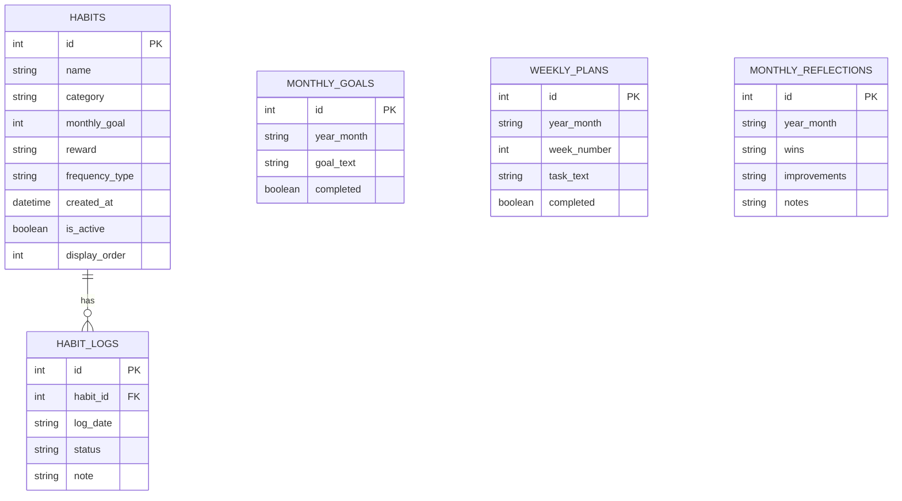

# GrowthOS Habit Tracker (Google Sheets Style)

A robust, 100% complete portfolio-grade habit tracker replicating the classic flexibility and aesthetics of a Google Sheets dashboard, built entirely in Python using Streamlit and SQLite.

## Core Features
*   **Massive Interactive Grid**: Clickable 31-day spreadsheet tracker supporting 4 states (`Completed`, `Missed`, `Skipped`, `N/A`).
*   **Visual Sparklines**: In-grid progress bars charting your monthly goals.
*   **Temporal Logic & Streaks**: Graceful handling of future dates, leap years, and paused streaks (for sick days).
*   **Lower Dashboard**: Includes macro Monthly Goals, Weekly Planning tasks, and dynamic Motivational Quotes.
*   **Data Portability**: Built-in CSV Export and SQLite Database Restore.
*   **Data Integrity**: Fully constrained SQLite backend preventing negative goals and invalid enum states.

## Architecture & Database Design

The application utilizes a normalized SQLite database.



## Setup & Installation

1.  Clone the repository.
2.  Install requirements:
    ```bash
    pip install -r requirements.txt
    ```
3.  Run the application (this automatically creates the SQLite database):
    ```bash
    streamlit run app.py
    ```
4.  *(Optional)* Seed mock history:
    ```bash
    python seed_mock_history.py
    ```

## Testing
This project includes a `pytest` suite testing temporal logic and database constraints.
```bash
pytest tests/
```

## Demo
*(Replace this section with a GIF or screenshot of the working application)*


## Why this approach?
Rather than using simple booleans (True/False) which fail when a user takes a vacation, this architecture implements an Enum-based `status` tracking system (`completed`, `missed`, `skipped`). This ensures historical streak data is preserved accurately.